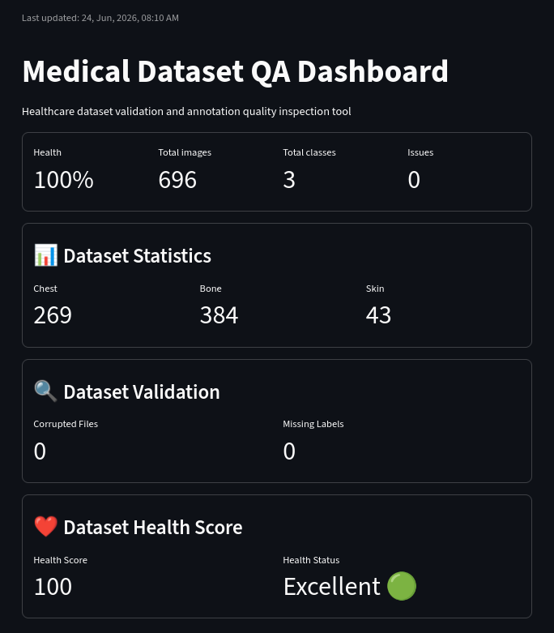
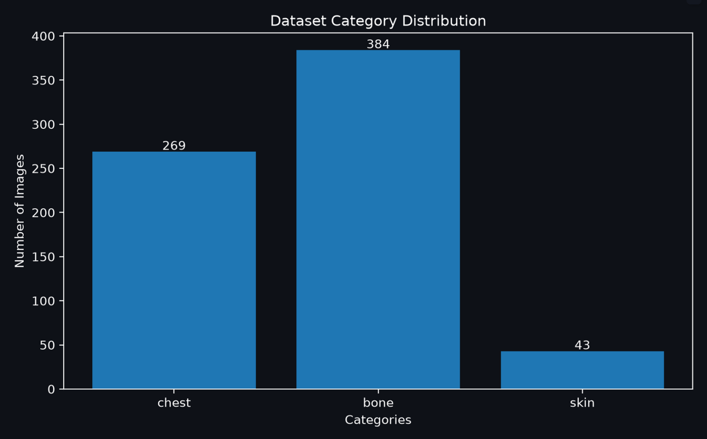
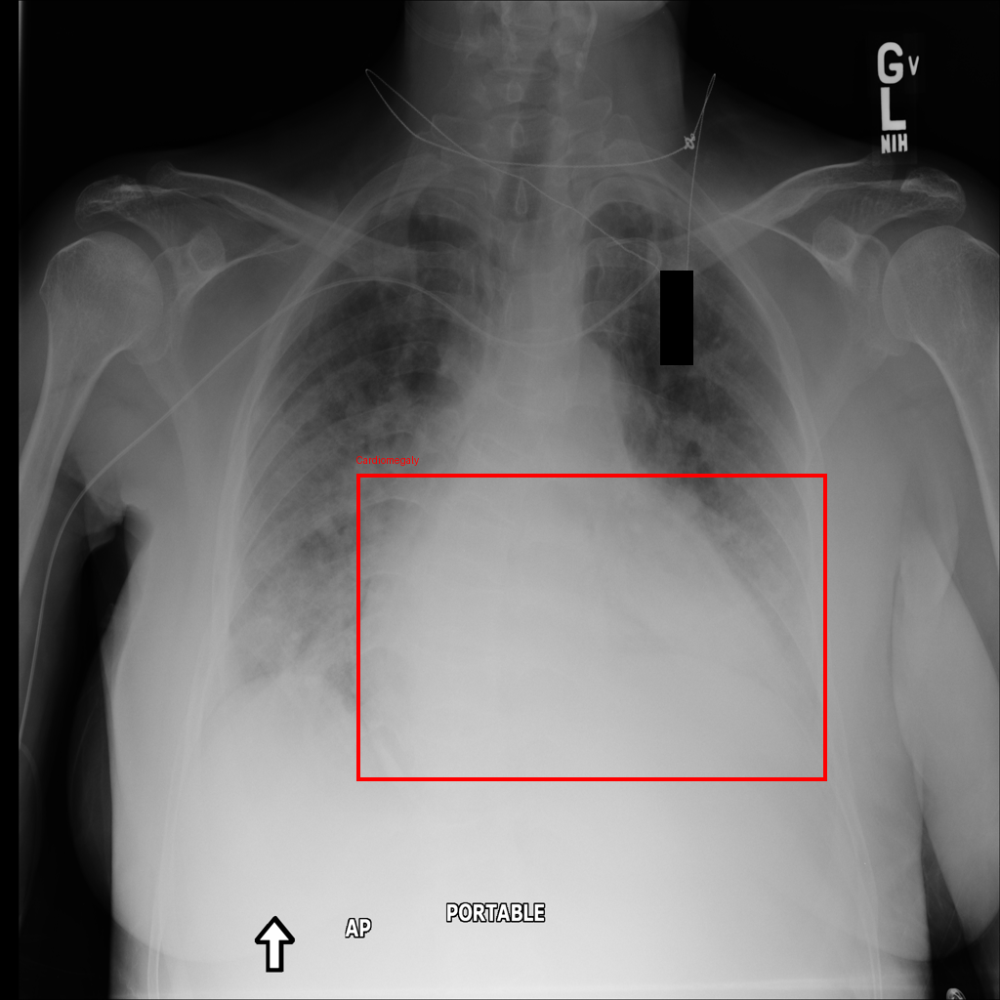
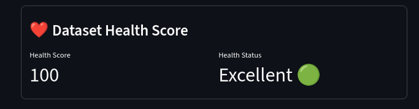

<div align="center">

# 🏥 Medical Annotation Dataset QA & Validation Tool

**A real-world medical image annotation pipeline and dataset quality assurance platform — not a diagnostic AI.**

[](https://python.org)
[](https://medinspect.streamlit.app/)
[](https://github.com/Dilpreet5/medical-annotation-dataset-qa)
[](LICENSE)
[](https://medinspect.streamlit.app/)

---



> **🔴 Live Demo:** [medinspect.streamlit.app](https://medinspect.streamlit.app/) &nbsp;|&nbsp; **📦 Repo:** [github.com/Dilpreet5/medical-annotation-dataset-qa](https://github.com/Dilpreet5/medical-annotation-dataset-qa)

</div>

---

## 📌 Table of Contents

- [About the Project](#-about-the-project)
- [Live Demo](#-live-demo)
- [Screenshots](#-screenshots)
- [Features](#-features)
- [Tech Stack](#-tech-stack)
- [Dataset Overview](#-dataset-overview)
- [Project Structure](#-project-structure)
- [Getting Started](#-getting-started)
- [Usage](#-usage)
- [Pipeline Flow](#-pipeline-flow)
- [QA Metrics](#-qa-metrics)
- [Why This Project](#-why-this-project)
- [License](#-license)
- [Contact](#-contact)

---

## 🔬 About the Project

Medical image datasets are messy, inconsistent, and risky if used without proper validation. This project tackles the **data side** of healthcare AI — not model training, but everything that needs to happen *before* a model can be trusted.

**What this project does:**

- 📁 **Collects & organizes** raw medical images from public sources (NIH, ISIC, bone fracture datasets)
- 🏷️ **Generates YOLO-format labels** automatically and semi-automatically
- 🔍 **Visually verifies** bounding boxes to catch annotation errors early
- 📊 **Validates dataset quality** — missing labels, class imbalance, corrupted files
- 🖥️ **Presents everything** in a live Streamlit dashboard with health scores

> **Note:** This is a data annotation and QA tool. It is **not** a medical diagnostic system. It does not detect or classify disease.

---

## 🚀 Live Demo

| | |
|---|---|
| **Dashboard URL** | [https://medinspect.streamlit.app/](https://medinspect.streamlit.app/) |
| **Platform** | Streamlit Cloud |
| **What you'll see** | Dataset stats, class distribution charts, QA validation results, health score |

---

## 📸 Screenshots

### Class Distribution Chart


  
---

### Visual Verification Sample
 

 
---

### Health Score Panel



---

## ✅ Features

### 🗂️ Data Collection & Organization
- Supports **3 medical imaging domains**: chest X-rays, skin lesions, bone fractures
- Sourced from public datasets: **NIH Chest X-ray**, **ISIC/HAM10000**, **Human Bone Fracture Dataset**
- Scripts for intelligent image selection by class/metadata

### 🏷️ YOLO Annotation Pipeline
- Auto-generates **YOLO `.txt` format** labels
- Semi-automated label creation from structured metadata
- Visual bounding box verification using OpenCV + PIL
- COCO JSON export support *(planned)*

### 🔍 Dataset Quality Assurance
- ✅ Missing label detection
- ✅ Corrupted file checks
- ✅ Class imbalance reporting
- ✅ Image count validation per class
- ✅ Health score calculation (0–100)

### 📊 Streamlit Dashboard
- Live dataset statistics (counts, classes, domains)
- Class distribution charts (Matplotlib)
- Health score display
- Visual QA summary in a clean UI

---

## 🛠️ Tech Stack

| Category | Technology |
|---|---|
| **Language** | Python 3.8+ |
| **Dashboard** | Streamlit |
| **Visualization** | Matplotlib |
| **Data Handling** | Pandas |
| **Image Processing** | OpenCV, PIL (Pillow) |
| **Annotation Formats** | YOLO `.txt`, COCO JSON |
| **Annotation Tools** | LabelImg, LabelStudio, CVAT |
| **Deployment** | Streamlit Cloud |
| **Version Control** | GitHub |
| **Dev Environment** | VS Code, Linux Mint, Python venv |

---

## 🗃️ Dataset Overview

| Domain | Source | Images | Classes |
|---|---|---|---|
| **Chest X-rays** | NIH Chest X-ray Dataset | 269 | Healthy, Cardiomegaly, Effusion, Pneumonia, Atelectasis |
| **Bone Fractures** | Human Bone Fracture C17 | 384 | Fracture, Normal |
| **Skin Lesions** | ISIC / HAM10000 | 43 | Lesion |
| **Total** | — | **697** | **3 domains** |

> **Note:** All datasets used are publicly available for research purposes. This project does **not** use proprietary or patient-identifiable data.

---

## 📁 Project Structure

```
medical-annotation-dataset-qa/
│
├── dataset/                        # Raw medical images (not tracked in Git)
│   ├── chest/                      # NIH chest X-rays
│   ├── skin/                       # ISIC skin lesion images
│   └── bone/                       # Bone fracture images
│
├── annotations/                    # YOLO .txt label files
│   ├── chest/
│   ├── skin/
│   └── bone/
│
├── python_pipeline/                # Core scripts
│   ├── copy_images.py              # Dataset copying / organization
│   ├── generate_yolo_labels.py     # Auto-generates YOLO labels
│   ├── visual_check.py             # Draws boxes on images for QA
│   ├── visual_skin_check.py        # Skin-specific visual verification
│   ├── select_bone_images.py       # Bone image sampling
│   └── expert_dataset.py           # Dataset export utilities
│
├── dashboard/                      # Streamlit dashboard package
│   ├── app.py                      # 🚀 Entry point — run this
│   ├── core/
│   │   ├── stats.py                # Image count logic
│   │   ├── qa_checks.py            # Missing labels / corrupted files
│   │   └── health_score.py         # Health score calculation
│   ├── visualization/
│   │   └── charts.py               # Matplotlib chart builders
│   └── utils/
│       └── constants.py            # Path configuration
│
├── screenshots/                    # Dashboard and verification screenshots
├── sample_dataset/                 # Small sample for demo / testing
└── README.md
```

---

## 🚀 Getting Started

### Prerequisites

```bash
Python 3.8+
pip
```

### Installation

```bash
# 1. Clone the repository
git clone https://github.com/Dilpreet5/medical-annotation-dataset-qa.git
cd medical-annotation-dataset-qa

# 2. Create and activate a virtual environment
python -m venv venv
source venv/bin/activate        # Linux / macOS
venv\Scripts\activate           # Windows

# 3. Install dependencies
pip install -r requirements.txt
```

### Run the Dashboard

```bash
streamlit run dashboard/app.py
```

Then open your browser at `http://localhost:8501`

---

## 💻 Usage

### 1. Generate YOLO Labels

```bash
python python_pipeline/generate_yolo_labels.py
```

Scans images in `dataset/` and outputs `.txt` label files into `annotations/`.

### 2. Visual Label Verification

```bash
python python_pipeline/visual_check.py
```

Draws bounding boxes from YOLO labels onto images and saves output into `screenshots/` for review.

### 3. Select / Sample Bone Images

```bash
python python_pipeline/select_bone_images.py
```

Filters bone images by class balance criteria.

### 4. Launch the QA Dashboard

```bash
streamlit run dashboard/app.py
```

Displays dataset stats, class distribution, QA results, and health score.

---

## 🔄 Pipeline Flow

```
Raw Medical Images
        │
        ▼
 Selection Scripts          ← select_bone_images.py, expert_dataset.py
 (filter by metadata)
        │
        ▼
YOLO Label Generation       ← generate_yolo_labels.py
 (.txt per image)
        │
        ▼
Visual Verification         ← visual_check.py, visual_skin_check.py
 (bounding box overlay)
        │
        ▼
QA Checks                   ← qa_checks.py, health_score.py
 (missing labels,
  corrupted files,
  class imbalance)
        │
        ▼
Streamlit Dashboard         ← dashboard/app.py
 (stats, charts,
  health score)
```

---

## 📊 QA Metrics

The dashboard computes and displays the following:

| Metric | Status |
|---|---|
| Total Images | ✅ 697 |
| Missing Labels | ✅ 0 |
| Corrupted Files | ✅ 0 |
| Classes Covered | ✅ 3 domains |
| **Dataset Health Score** | ✅ **100 / 100** |

> Health score is calculated based on label completeness, file integrity, and class coverage.

---

## 💡 Why This Project

Most ML portfolios jump straight to model training. This project focuses on what comes first — and what often goes wrong:

| Common Problem | How This Project Addresses It |
|---|---|
| Missing labels | Automated missing label detection |
| Class imbalance | Per-class count visibility + imbalance warnings |
| Corrupted files | File integrity checks before any training |
| No visibility | Live dashboard shows dataset state at a glance |
| Messy repo | Structured folder layout with clear naming |

This is relevant for roles in **data annotation**, **AI operations**, **QA engineering**, and **healthcare data** — because it shows the full path from raw images to validated, model-ready data.

---

## 📄 License

This project is licensed under the **MIT License** — see the [LICENSE](LICENSE) file for details.

> Dataset licenses: NIH Chest X-ray (public domain), ISIC HAM10000 (CC-BY-NC), Bone Fracture Dataset (public research use). Always check original dataset terms before using.

---

## 👤 Contact

**Dilpreet** — [@Dilpreet5](https://github.com/Dilpreet5)

📬 Feel free to open an [issue](https://github.com/Dilpreet5/medical-annotation-dataset-qa/issues) or start a discussion for any questions or feedback.

---

<div align="center">

**⭐ If this project helped you, give it a star!**

Built with 🏥 for healthcare data annotation workflows

</div>